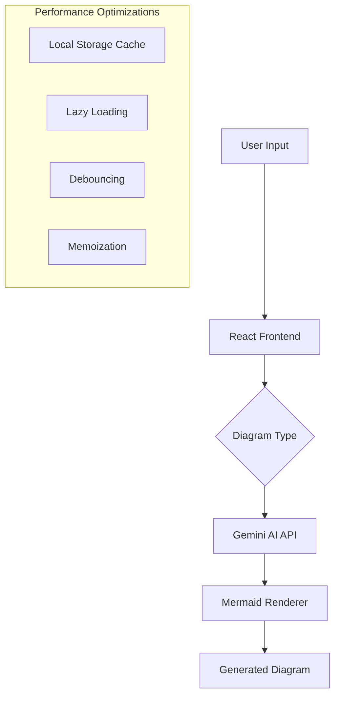

# Flow.AI - AI-Powered Diagram Generator

A React-based application that leverages Google's Gemini AI to generate Mermaid.js diagrams from natural language descriptions.

## Architecture



## Features

### **Transform Natural Language into Diagrams**
Effortlessly convert your ideas into structured diagrams using simple natural language prompts.

### **Supported Diagram Types**
Unlock the power of visualization with support for a wide range of diagram types:

- **Flowcharts**: Visualize workflows and processes with ease.  
- **Sequence Diagrams**: Depict the interaction between objects over time.  
- **Class Diagrams**: Showcase object-oriented structures for better understanding.  
- **Entity Relationship Diagrams (ERD)**: Represent database schemas and relationships.  
- **State Diagrams**: Track transitions between states in a system.  
- **Gantt Charts**: Plan and visualize project timelines effectively.  
- **Pie Charts**: Illustrate proportions in an engaging, circular format.  
- **User Journey Diagrams**: Map the user experience through various stages.  
- **Git Graphs**: Understand branching and merging in Git repositories.  
- **C4 Diagrams**: Model software architecture at multiple abstraction levels.

## Tech Stack

-  **React 18**  


-  **Framer Motion**  


-  **TailwindCSS**  


-  **Google Gemini AI**  


-  **Mermaid.js**  

## Performance Optimizations

### Caching System
The application incorporates a robust caching system designed to improve performance and reduce unnecessary API calls. By utilizing local storage, frequently used data is saved directly in the user's browser, ensuring faster retrieval during subsequent visits. To maintain data freshness and prevent stale information, cache invalidation is implemented, automatically clearing or updating stored data after 24 hours. Additionally, request deduplication ensures that multiple identical requests made within a short timeframe are consolidated into a single API call, reducing server load and enhancing efficiency.

### Code Splitting
Code splitting is employed to optimize the loading process by breaking the application into smaller chunks. Components are lazily loaded, meaning they are only fetched when required, reducing the initial load time. Dynamic imports allow the application to load specific parts of the codebase on demand, further minimizing unnecessary overhead. Route-based chunking divides the application into distinct chunks based on user navigation paths, ensuring that users download only the resources they need for the current route.

### State Management
To ensure seamless and efficient application performance, advanced state management techniques are used. Memoized computations store the results of expensive calculations and reuse them when the same inputs occur, saving processing power. API calls are debounced to prevent excessive requests during rapid user interactions, such as typing in a search field. Optimized re-renders ensure that only the necessary parts of the user interface update when data changes, enhancing responsiveness and conserving resources.

### Asset Optimization
The application is designed with asset optimization techniques to enhance the user experience. Progressive loading ensures that content is loaded in stages, prioritizing critical elements to appear quickly while the rest loads in the background. Suspense boundaries are implemented to provide smooth transitions and handle asynchronous content gracefully, ensuring the UI remains responsive. Additionally, error boundaries catch and handle runtime errors effectively, preventing crashes and displaying fallback content to maintain a seamless user experience.

## Installation

1. Clone the repository:  
   ```bash
   git clone https://github.com/yourusername/flow-AI-Powered-Diagram-Generator.git
   ```

2. Navigate to the project directory:

    ```bash
    cd flow-AI-Powered-Diagram-Generator
    ```
3. Install dependencies:

    ```bash
    npm install
    ```

## Environment Configuration
Create a .env file in the root of your project and add the required environment variables.

## Contributing

We welcome contributions to improve and expand this project! Follow these steps to contribute:

1. Fork the repository.
2. Create your feature branch.
3. Commit your changes.
4. Push your changes to the branch.
5. Submit a Pull Request for review.

## License

This project is licensed under the **MIT License**. For more information, see the [LICENSE](LICENSE) file.

## Contact

If you have any questions or feedback, feel free to reach out:

- **GitHub**: [@kedarvartak](https://github.com/kedarvartak)
- **Email**: [kedar.vartak22@vit.edu](mailto:kedar.vartak22@vit.edu)

## Acknowledgments

A special thanks to the following for their contributions and support:

- **Google Gemini AI**: For its AI-driven capabilities.
- **Mermaid.js**: For enabling seamless diagram generation.
- **React Community**: For providing a robust framework and resources.


